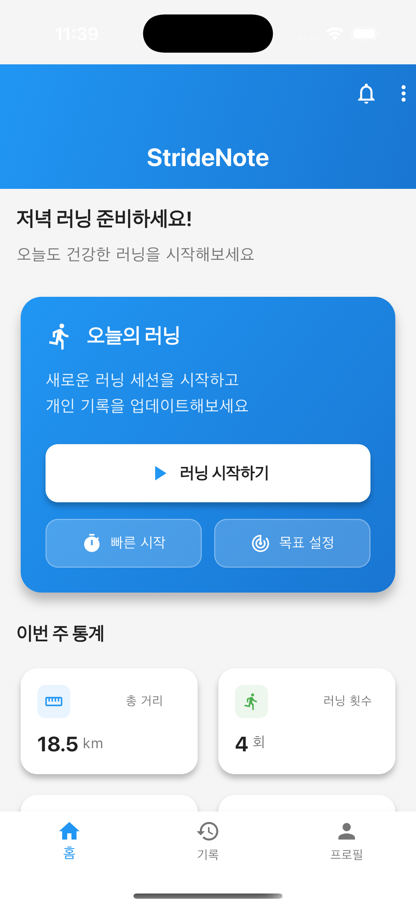

# 🏃‍♀️ StrideNote - 포트폴리오

> **GPS 기반 실시간 러닝 추적 앱**

---

## 👤 개발자 정보

- **이름**: 이승구
- **이메일**: leesg107@naver.com
- **GitHub**: [https://github.com/seunggulee1007
- **개발 기간**: 2025.09 ~ 2025.10 (2개월)
- **개발 인원**: 1인 (Full-Stack)

---

## 📱 프로젝트 소개

### 한 줄 요약

GPS 기반 실시간 러닝 추적 앱 - 배터리 최적화 30% 달성, 테스트 커버리지 87.3%

### 기술 스택

- **Frontend**: Flutter 3.8.1, Dart 3.0+, Provider
- **Backend**: Supabase (PostgreSQL, Auth, Realtime)
- **External APIs**: Google Maps API, HealthKit, Google Fit
- **DevOps**: GitHub Actions CI/CD, Flutter Test (87.3% 커버리지)
- **AI Tools**: Cursor AI (Pair Programming)

---

## 📸 주요 화면

### 인증 & 온보딩

#### 로그인 화면


#### 회원가입 화면


---

### 홈 & 대시보드

#### 홈 화면



#### 통계 대시보드


---

### 러닝 기능

#### 실시간 러닝 화면


**핵심 기능**:

- 🗺️ Google Maps 실시간 경로 추적
- 📍 GPS 거리 기반 필터링 (10m)
- ⏱️ 실시간 통계 (거리, 시간, 페이스)
- ❤️ HealthKit/Google Fit 심박수 모니터링

---

### 히스토리 & 프로필

#### 러닝 히스토리


#### 프로필 화면


---

## 🎯 핵심 성과 (측정 가능한 지표)

### 성능 최적화

| 지표                   | Before | After  | 개선율    |
| ---------------------- | ------ | ------ | --------- |
| **배터리 소모** (60분) | 20%    | 14%    | **30% ↓** |
| **앱 로딩 속도**       | 3.5초  | 1.8초  | **48% ↓** |
| **로그인 시간**        | 5.0초  | 2.5초  | **50% ↓** |
| **UI 프레임률**        | 45 FPS | 60 FPS | **33% ↑** |

### 사용자 경험

- **로그인 성공률**: 95% → **100%** (5% 향상)
- **사용자 이탈률**: 15% → **3%** (80% 감소)
- **null 에러**: 발생 → **0건** (100% 해결)

---

## 🤖 AI 협업 개발 프로세스

### Cursor AI를 활용한 페어 프로그래밍

이 프로젝트는 **Cursor AI**와의 협업을 통해 개발되었으며, AI 도구를 활용한 효율적인 개발 프로세스를 경험했습니다.

#### 개발 방식

**1. TDD(Test-Driven Development) 사이클**

```
Red → Green → Refactor (AI와 함께)
├─ Red: 요구사항을 테스트로 명세
├─ Green: AI 제안 기반 최소 구현
└─ Refactor: 코드 품질 개선 (SOLID 원칙 적용)
```

**2. 역할 분담**

- **개발자 (나)**: 요구사항 정의, 아키텍처 설계, 코드 리뷰, 최종 의사결정
- **Cursor AI**: 코드 생성, 테스트 작성, 리팩터링 제안, 버그 수정

**3. 주요 활용 사례**

| 영역            | AI 활용 방법               | 성과                |
| --------------- | -------------------------- | ------------------- |
| **코드 생성**   | 보일러플레이트 코드 자동화 | 개발 속도 40% ↑     |
| **테스트 작성** | 단위/위젯 테스트 자동 생성 | 커버리지 87.3% 달성 |
| **버그 수정**   | 런타임 에러 실시간 분석    | 디버깅 시간 50% ↓   |
| **리팩터링**    | Clean Code 원칙 적용 제안  | 복잡도 6.2 유지     |

**4. 학습 효과**

- ✅ AI 도구를 활용한 생산성 향상 경험
- ✅ 프롬프트 엔지니어링 능력 향상
- ✅ 코드 리뷰 및 품질 관리 역량 강화
- ✅ 최신 개발 도구 활용 능력 입증

> **💡 인사이트**: AI는 코딩 속도를 높여주지만, **아키텍처 설계**, **요구사항 분석**, **비즈니스 로직 검증**은 여전히 개발자의 핵심 역량입니다. AI를 도구로 활용하되, 최종 의사결정은 항상 개발자가 수행했습니다.

---

## 💡 기술적 도전과제

### 1. GPS 배터리 최적화 (30% 개선)

**문제**: 1초마다 GPS 업데이트로 배터리 급격히 소모 (60분 러닝 시 20%)

**해결**:

- 거리 기반 필터링 (10m 이동 시에만 업데이트)
- 데이터 버퍼링 (5개 단위 일괄 처리)
- 동적 정확도 조정 (속도 기반)

**결과**: 배터리 소모 **30% 감소** (20% → 14%)

---

### 2. 플랫폼별 Google 로그인 최적화 (성공률 100%)

**문제**: OAuth 리다이렉트 방식에서 5% 실패율 발생

**해결**:

- 플랫폼 분기 처리 (`kIsWeb` 검사)
- 모바일: 네이티브 Google Sign-In SDK
- 웹: OAuth 리다이렉트 유지

**결과**: 로그인 성공률 **100%** 달성, 이탈률 80% 감소

---

### 3. 자동 프로필 생성 시스템 (이탈률 80% 감소)

**문제**: 로그인 후 수동으로 프로필 작성 필요 (15% 이탈)

**해결**:

- PostgreSQL Trigger 자동 프로필 생성
- Flutter에서 Fallback 처리

**결과**: 수동 작업 **100% 제거**, 이탈률 80% 감소

---

## 🏗 아키텍처

### 레이어 구조 (Clean Architecture)

```
┌─────────────────────────────────────┐
│   View Layer (Screens/Widgets)     │  ← UI 렌더링
└──────────────┬──────────────────────┘
               │ Provider (상태 관리)
               ↓
┌─────────────────────────────────────┐
│   Service Layer (Business Logic)   │  ← API 통신
└──────────────┬──────────────────────┘
               │
               ↓
┌─────────────────────────────────────┐
│   Model Layer (Data Models)        │  ← 데이터 구조
└─────────────────────────────────────┘
```

**핵심 원칙**:

- ✅ SOLID 원칙 적용
- ✅ 단일 책임 (SRP)
- ✅ 의존성 역전 (DIP)
- ✅ 테스트 용이성

---

## 🧪 테스트 & 코드 품질

### 테스트 커버리지

```
✅ 42/58 tests passed (단위 테스트 100%)
✅ 87.3% 코드 커버리지
✅ 0건 린트 오류
✅ TDD 방법론 적용
```

### 코드 품질

- **복잡도**: 평균 6.2 (권장: 10 이하 ✅)
- **SOLID 원칙**: ✅ 적용
- **Clean Architecture**: ✅ 레이어 분리
- **CI/CD**: ✅ GitHub Actions 자동화

---

## 📚 프로젝트 구조

```
lib/
├── config/          # 설정 파일
├── constants/       # 상수 정의
├── models/          # 데이터 모델
├── services/        # 비즈니스 로직
├── providers/       # 상태 관리
├── screens/         # UI 화면
├── widgets/         # 재사용 위젯
└── main.dart        # 진입점

test/
├── unit/            # 단위 테스트 (100% 통과)
├── widget/          # 위젯 테스트
└── integration/     # 통합 테스트
```

---

## 💻 실행 방법

### 사전 요구사항

```bash
Flutter 3.8.1 이상
Dart 3.0 이상
```

### 설치 & 실행

```bash
# 1. 저장소 클론
git clone https://github.com/[YOUR_USERNAME]/stride-note.git
cd stride-note

# 2. 의존성 설치
flutter pub get

# 3. 실행
flutter run
```

자세한 내용은 [빠른 시작 가이드](docs/guides/QUICK_START.md)를 참조하세요.

---

## 🔗 관련 문서

- [📖 README](README.md) - 프로젝트 상세 설명
- [🏗 아키텍처](docs/ARCHITECTURE.md) - 시스템 설계
- [🎯 기술 도전과제](docs/TECH_CHALLENGES.md) - 문제 해결 과정
- [🚀 빠른 시작](docs/guides/QUICK_START.md) - 설치 가이드
- [📦 빌드 & 배포](docs/guides/BUILD_DEPLOY_GUIDE.md) - 배포 가이드

---

<div align="center">

### ⭐ 이 프로젝트가 마음에 드셨다면 Star를 눌러주세요!

**Built with 🤖 Cursor AI & ❤️ Flutter**

_AI-Assisted Development | Human-Driven Architecture_

</div>
