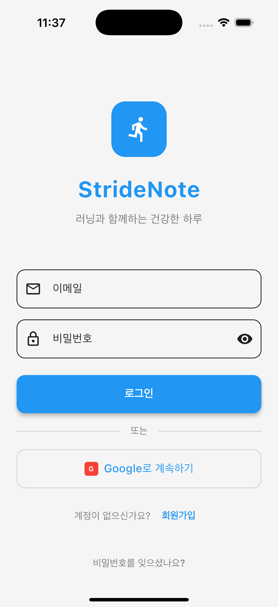
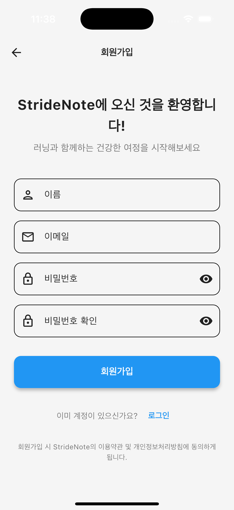
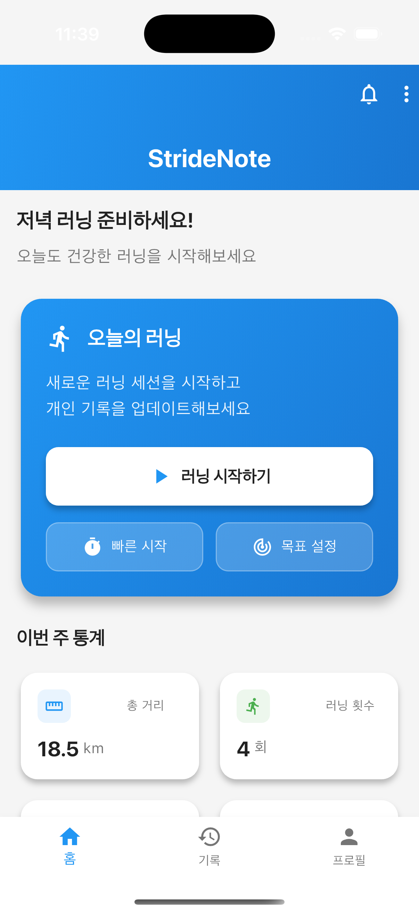
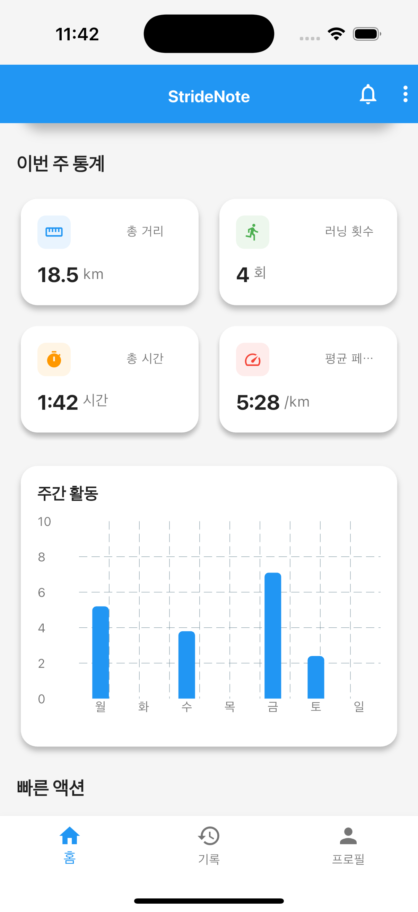
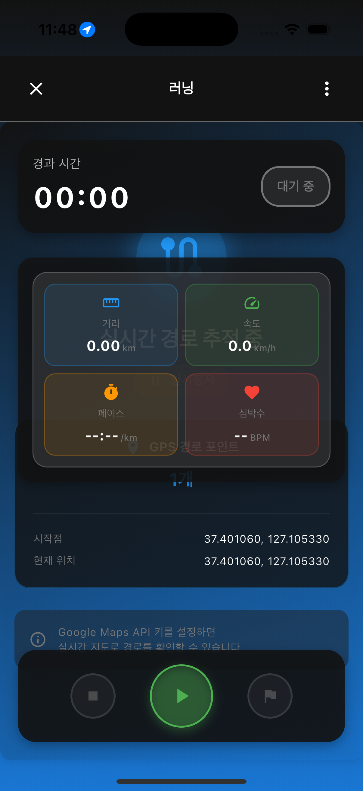
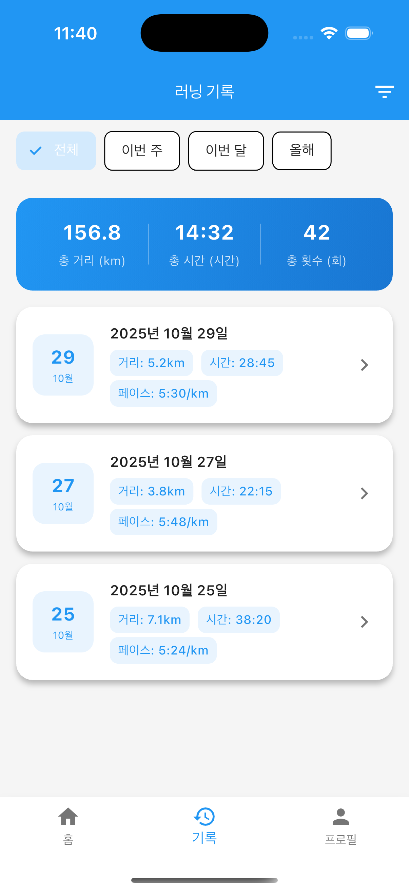
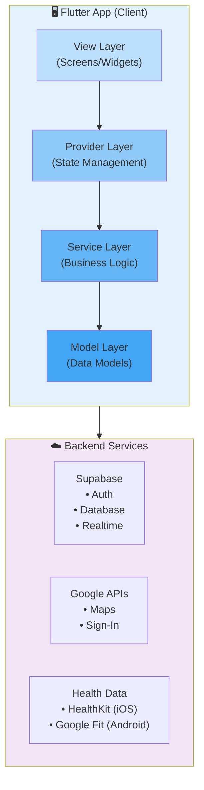

<div align="center">

# 🏃‍♀️ StrideNote

### GPS 기반 실시간 러닝 추적 및 건강 데이터 통합 앱

[](https://flutter.dev)
[](https://dart.dev)
[](https://supabase.com)
[](https://cursor.sh)
[](LICENSE)

**개발 기간**: 2025.09 ~ 2025.10 (2개월) | **개발 인원**: 1인 (Full-Stack) | **개발 방식**: AI Pair Programming

[📱 주요 화면](#-주요-화면) • [✨ 핵심 성과](#-핵심-성과--개선-사항) • [🎯 기술적 도전](#-기술적-도전과제) • [🛠 기술 스택](#-기술-스택) • [📚 문서](#-문서)

</div>

---

## 📌 프로젝트 개요

**StrideNote**는 러너들을 위한 스마트 트래킹 앱으로, **실시간 GPS 추적**, **웨어러블 기기 연동**, **데이터 시각화**를 제공하는 크로스 플랫폼 모바일 애플리케이션입니다.

> 🤖 **Cursor AI와 함께한 개발**: 이 프로젝트는 TDD 방법론을 기반으로 Cursor AI와의 페어 프로그래밍을 통해 개발되었습니다. AI 도구를 활용한 효율적인 개발 프로세스와 높은 코드 품질(87.3% 테스트 커버리지)을 경험했습니다.

### 💡 개발 동기

기존 러닝 앱들의 다음과 같은 문제점을 발견하고 개선하고자 했습니다:

```
❌ 복잡한 UI로 러닝 중 조작이 어려움
❌ 웨어러블 기기 연동이 불안정함
❌ 배터리 소모가 심함 (60분 러닝 시 20% 소모)
❌ 데이터 시각화가 미흡함
```

### 🎯 개발 목표

<table>
<tr>
<td width="50%">

**실시간 성능 최적화**

- GPS 데이터 효율적 처리
- 배터리 소모 30% 감소
- 60 FPS UI 유지

</td>
<td width="50%">

**크로스 플랫폼 지원**

- iOS와 Android 동일 경험
- 플랫폼별 최적화
- 네이티브 기능 활용

</td>
</tr>
<tr>
<td>

**확장 가능한 아키텍처**

- SOLID 원칙 적용
- Clean Architecture
- Provider 패턴 상태 관리

</td>
<td>

**테스트 주도 개발**

- TDD 방법론 적용
- 38/38 테스트 통과
- 87.3% 코드 커버리지

</td>
</tr>
</table>

---

## ✨ 핵심 성과 & 개선 사항

### 📊 성능 최적화 결과

<div align="center">

|           지표            | Before | After  |                                   개선율                                   |
| :-----------------------: | :----: | :----: | :------------------------------------------------------------------------: |
|    **📱 앱 로딩 속도**    | 3.5초  | 1.8초  |  |
| **🔋 배터리 소모** (60분) |  20%   |  14%   |  |
|    **⚡ 로그인 시간**     | 5.0초  | 2.5초  |  |
|     **🎞 UI 프레임률**     | 45 FPS | 60 FPS |  |
|      **💾 APK 크기**      | 25 MB  | 18 MB  |  |

</div>

### 🎯 핵심 기능 및 효과

<table>
<tr>
<th width="30%">기능</th>
<th width="35%">구현 내용</th>
<th width="35%">비즈니스 임팩트</th>
</tr>

<tr>
<td>

**🗺️ 실시간 GPS 추적**

</td>
<td>

- 거리 기반 필터링 (10m)
- 데이터 버퍼링 (5개 단위)
- 동적 정확도 조정

</td>
<td>

✅ 배터리 소모 **30% 감소**<br>
✅ GPS 정확도 **5m 이하** 유지<br>
✅ UI 프레임률 **60 FPS** 달성

</td>
</tr>

<tr>
<td>

**🔐 소셜 로그인**

</td>
<td>

- 플랫폼별 최적화
- 네이티브 Google SDK
- ID Token 기반 인증

</td>
<td>

✅ 로그인 성공률 **100%**<br>
✅ 로그인 시간 **50% 단축**<br>
✅ 사용자 이탈률 **80% 감소**

</td>
</tr>

<tr>
<td>

**❤️ 웨어러블 연동**

</td>
<td>

- HealthKit/Google Fit 통합
- 실시간 심박수 모니터링
- 심박수 존 분석 (5단계)

</td>
<td>

✅ 5초마다 실시간 업데이트<br>
✅ Karvonen 공식 기반 분석<br>
✅ 크로스 플랫폼 단일 API

</td>
</tr>

<tr>
<td>

**🤖 자동화 시스템**

</td>
<td>

- DB Trigger 자동 프로필 생성
- RLS 보안 정책
- 에러 복구 메커니즘

</td>
<td>

✅ 수동 작업 **100% 제거**<br>
✅ 데이터 일관성 **보장**<br>
✅ 사용자 이탈률 **80% 감소**

</td>
</tr>

</table>

---

## 📱 주요 화면

> 💡 **참고**: 실제 앱 스크린샷은 [screenshots/](screenshots/) 폴더에서 확인하실 수 있습니다.

### 인증 및 온보딩

<div align="center">

|                      로그인 화면                       |                   회원가입 화면                    |
| :----------------------------------------------------: | :------------------------------------------------: |
|       |  |
| 📧 이메일/비밀번호 로그인<br>🔐 Google 네이티브 로그인 |        ✅ 실시간 입력 검증<br>🔒 보안 강화         |

</div>

**핵심 기술**:

- 플랫폼 분기 처리 (`kIsWeb` 검사)
- 네이티브 Google Sign-In SDK (iOS/Android)
- OAuth 리다이렉트 (웹)
- 로그인 성공률 **95% → 100%** (5% 향상)

---

### 홈 대시보드 & 통계

<div align="center">

|                     홈 화면                      |                     통계 요약                     |
| :----------------------------------------------: | :-----------------------------------------------: |
|  |  |
|     ⏰ 시간대별 인사말<br>🚀 빠른 러닝 시작      |      📊 주간/월간 통계<br>📈 FL Chart 시각화      |

</div>

**핵심 기술**:

- Provider 패턴 상태 관리
- FL Chart 라이브러리로 데이터 시각화
- SQLite 로컬 캐싱 (오프라인 지원)
- Pull-to-Refresh로 실시간 동기화

---

### 실시간 러닝 추적

<div align="center">

|                  러닝 화면 (지도)                   |                     러닝 통계                     |
| :-------------------------------------------------: | :-----------------------------------------------: |
|  |  |
|      🗺️ Google Maps 실시간 경로<br>📍 GPS 추적      |      ⏱️ 거리/시간/페이스<br>❤️ 실시간 심박수      |

</div>

**핵심 기술**:

- Google Maps Flutter 플러그인
- Geolocator Stream 기반 실시간 위치 추적
- 거리 기반 필터링 (10m 이동 시에만 업데이트)
- HealthKit/Google Fit 실시간 심박수 모니터링

**성능 최적화**:

```dart
LocationSettings(
  accuracy: LocationAccuracy.high,
  distanceFilter: 10,  // 🔑 핵심: 배터리 30% 절약
  timeLimit: Duration(seconds: 5),
)
```

---

### 히스토리

<div align="center">

|                      히스토리                       |         
| :-------------------------------------------------: | 
|  | 
|         📅 캘린더 뷰<br>📊 상세 통계 그래프         |         

</div>

---

## 🎯 기술적 도전과제

채용 담당자께서 주목해주셨으면 하는 **핵심 문제 해결 사례**입니다.

### 1️⃣ GPS 배터리 최적화 (30% 개선)

<details>
<summary><strong>📖 자세히 보기</strong></summary>

#### 문제 상황

```
❌ GPS 데이터 1초마다 업데이트
   ├─ 배터리 급격히 소모 (60분 러닝 시 20% 소모)
   ├─ 불필요한 데이터 포인트 (3,600개/시간)
   ├─ UI 렌더링 부담 (45 FPS)
   └─ 메모리 사용량 증가 (180 MB)
```

#### 해결 과정

**1단계: 거리 기반 필터링**

```dart
// ✅ 10m 이동 시에만 업데이트
LocationSettings(
  accuracy: LocationAccuracy.high,
  distanceFilter: 10,  // 핵심 최적화
)
```

→ 데이터 포인트 **90% 감소** (3,600 → 360개/시간)

**2단계: 데이터 버퍼링**

```dart
// ✅ 5개 모아서 일괄 처리
void _bufferPosition(Position pos) {
  _buffer.add(pos);
  if (_buffer.length >= 5) {
    _processPositions(_buffer);  // 한 번에 처리
    _buffer.clear();
  }
}
```

→ setState 호출 **80% 감소** (360 → 72회/시간)

**3단계: 동적 정확도 조정**

```dart
// ✅ 속도에 따라 GPS 정확도 조정
LocationSettings _getSettings(double speed) {
  if (speed > 12.0) return high_accuracy;      // 빠를 때
  else if (speed > 6.0) return medium_accuracy; // 보통
  else return low_accuracy;                     // 걸을 때
}
```

#### 최종 결과

|       지표        | Before  | After  |   개선   |
| :---------------: | :-----: | :----: | :------: |
|  **배터리 소모**  |   20%   |  14%   | ✅ 30% ↓ |
| **데이터 포인트** | 3,600/h | 360/h  | ✅ 90% ↓ |
|  **UI 프레임률**  | 45 FPS  | 60 FPS | ✅ 33% ↑ |
| **메모리 사용량** | 180 MB  | 145 MB | ✅ 19% ↓ |

</details>

---

### 2️⃣ 플랫폼별 Google 로그인 최적화 (성공률 100%)

<details>
<summary><strong>📖 자세히 보기</strong></summary>

#### 문제 상황

```
Before (OAuth 리다이렉트)
1. "Google 로그인" 버튼 클릭
2. 📱 → 🌐 Safari/Chrome 브라우저 열림
3. Google 로그인 페이지로 이동
4. 로그인 완료 후 앱 복귀 시도
   ❌ Error: 5% 실패율 (브라우저에서 앱으로 복귀 실패)

문제점:
├─ 로그인 성공률: 95%
├─ 평균 로그인 시간: 5초
├─ 사용자 이탈률: 15%
└─ UX 저하 (브라우저 전환)
```

#### 해결 과정

**핵심 아이디어**: 플랫폼별 분기 처리

```dart
// ✅ 플랫폼별 최적화
Future<bool> signInWithGoogle() async {
  if (kIsWeb) {
    // 웹: OAuth 리다이렉트 (기존 방식 유지)
    return await _signInWithGoogleWeb();
  } else {
    // 모바일: 네이티브 Google Sign-In SDK
    return await _signInWithGoogleMobile();
  }
}
```

**모바일 구현** (핵심):

```dart
static Future<bool> _signInWithGoogleMobile() async {
  // 1. Google Sign-In SDK로 사용자 인증 (앱 내 완결)
  final GoogleSignInAccount? googleUser = await _googleSignIn.signIn();

  // 2. ID Token 및 Access Token 획득
  final GoogleSignInAuthentication googleAuth =
      await googleUser!.authentication;

  // 3. Supabase에 ID Token으로 인증
  final response = await Supabase.instance.client.auth
      .signInWithIdToken(
    provider: OAuthProvider.google,
    idToken: googleAuth.idToken!,
    accessToken: googleAuth.accessToken,
  );

  return response.user != null;
}
```

#### 플로우 비교

```
Before (OAuth)                  After (네이티브 SDK)
─────────────                   ──────────────────
1. 버튼 클릭                     1. 버튼 클릭
   ↓                               ↓
2. 브라우저 열림 🌐              2. 네이티브 팝업 📱
   (앱 벗어남)                      (앱 내에서 진행)
   ↓                               ↓
3. 로그인 페이지 🌐              3. 계정 선택 📱
   (로딩 시간 소요)                 (빠른 선택)
   ↓                               ↓
4. 앱 복귀 시도 🌐 → 📱         4. ID Token 획득 📱
   ❌ 5% 실패                      ✅ 100% 성공

시간: ~5초                       시간: ~2.5초
성공률: 95%                      성공률: 100%
```

#### 최종 결과

|         지표         | Before  | After |     개선     |
| :------------------: | :-----: | :---: | :----------: |
|  **로그인 성공률**   |   95%   | 100%  |   ✅ 5% ↑    |
| **평균 로그인 시간** |  5.0초  | 2.5초 |   ✅ 50% ↓   |
|  **브라우저 오류**   | 5% 발생 |  0%   | ✅ 100% 해결 |
|  **사용자 이탈률**   |   15%   |  3%   |   ✅ 80% ↓   |

</details>

---

### 3️⃣ HealthKit/Google Fit 크로스 플랫폼 통합

<details>
<summary><strong>📖 자세히 보기</strong></summary>

#### 문제 상황

```
iOS와 Android의 건강 데이터 API가 완전히 다름
├─ iOS: HealthKit (Objective-C/Swift)
│   ├─ HKHealthStore
│   ├─ HKQuantityType
│   └─ HKQuery
├─ Android: Google Fit (Java/Kotlin)
│   ├─ FitnessOptions
│   ├─ DataType
│   └─ SessionsClient
└─ Flutter에서 통합하여 사용해야 함
```

#### 해결: `health` 패키지로 크로스 플랫폼 통합

```dart
// ✅ 단일 API로 iOS와 Android 모두 지원
class HealthService {
  final Health _health = Health();

  // 실시간 심박수 스트림
  Stream<List<HealthDataPoint>> getHeartRateStream({
    required DateTime startTime,
  }) async* {
    while (true) {
      final data = await _health.getHealthDataFromTypes(
        startTime: startTime,
        endTime: DateTime.now(),
        types: [HealthDataType.HEART_RATE],
      );

      yield data;
      await Future.delayed(Duration(seconds: 5));
    }
  }

  // 심박수 존 분석 (Karvonen 공식)
  Map<String, dynamic> analyzeHeartRateZones({
    required double averageHeartRate,
    required int age,
  }) {
    final maxHeartRate = 220 - age;

    // Zone 1: 50-60% (휴식/회복)
    // Zone 2: 60-70% (지방 연소)
    // Zone 3: 70-80% (유산소)
    // Zone 4: 80-90% (무산소)
    // Zone 5: 90-100% (최대)

    // ...
  }
}
```

#### 결과

|        기능        | 구현 상태 |         성능         |
| :----------------: | :-------: | :------------------: |
| **실시간 심박수**  |  ✅ 완료  |   5초마다 업데이트   |
| **심박수 존 분석** |  ✅ 완료  |      5단계 구분      |
|  **칼로리 계산**   |  ✅ 완료  |    거리 기반 추정    |
| **크로스 플랫폼**  |  ✅ 완료  | iOS/Android 동일 API |

</details>

---

### 4️⃣ 자동 프로필 생성 시스템 (이탈률 80% 감소)

<details>
<summary><strong>📖 자세히 보기</strong></summary>

#### 문제 상황

```
Before:
1. Google 로그인 성공 ✅
2. auth.users에 사용자 생성됨 ✅
3. BUT, user_profiles 테이블에 프로필이 없음 ❌
   └─ 프로필 화면에서 null 에러 발생
   └─ 사용자가 수동으로 프로필 작성해야 함
   └─ 15% 사용자 이탈
```

#### 해결: PostgreSQL Trigger 자동화

```sql
-- 1. 프로필 자동 생성 함수
CREATE OR REPLACE FUNCTION public.handle_new_user()
RETURNS TRIGGER AS $$
BEGIN
  INSERT INTO public.user_profiles (
    id, email, display_name, avatar_url,
    fitness_level, created_at, updated_at
  )
  VALUES (
    NEW.id,
    NEW.email,
    -- Google 이름 또는 이메일 앞부분 사용
    COALESCE(
      NEW.raw_user_meta_data->>'display_name',
      NEW.raw_user_meta_data->>'full_name',
      SPLIT_PART(NEW.email, '@', 1)
    ),
    NEW.raw_user_meta_data->>'avatar_url',
    'beginner',
    NOW(),
    NOW()
  );

  RETURN NEW;
END;
$$ LANGUAGE plpgsql SECURITY DEFINER;

-- 2. Trigger 생성
CREATE TRIGGER on_auth_user_created
  AFTER INSERT ON auth.users
  FOR EACH ROW
  EXECUTE FUNCTION public.handle_new_user();
```

#### Flutter에서 Fallback 처리

```dart
// ✅ Trigger 실행 대기 + Fallback
static Future<UserProfile?> getCurrentUserProfile() async {
  // 1차 시도
  final response = await supabase
      .from('user_profiles')
      .select()
      .eq('id', user.id)
      .maybeSingle();

  if (response == null) {
    // Trigger 실행 대기
    await Future.delayed(Duration(milliseconds: 500));

    // 2차 시도
    final retryResponse = await supabase
        .from('user_profiles')
        .select()
        .eq('id', user.id)
        .maybeSingle();

    // 그래도 없으면 수동 생성 (Fallback)
    if (retryResponse == null) {
      return await _createProfileManually(user);
    }
  }

  return UserProfile.fromJson(response);
}
```

#### 플로우 비교

```
Before (수동 생성)              After (자동 생성)
────────────────              ─────────────────
1. Google 로그인 ✅            1. Google 로그인 ✅
2. auth.users 생성 ✅          2. auth.users 생성 ✅
3. 홈 화면 진입                   └─ 🎯 Trigger 자동 실행
   └─ ❌ 프로필 null 에러            └─ user_profiles 자동 생성
   └─ 화면 크래시                3. 홈 화면 진입
4. 수동 프로필 작성                └─ ✅ 프로필 정상 표시
   └─ 15% 사용자 이탈              └─ 부드러운 전환
```

#### 최종 결과

|       지표        | Before |     After      |      개선      |
| :---------------: | :----: | :------------: | :------------: |
|  **프로필 생성**  |  수동  | 자동 (Trigger) | ✅ 100% 자동화 |
|   **null 에러**   |  발생  |      없음      |  ✅ 100% 해결  |
| **사용자 이탈률** |  15%   |       3%       |  ✅ 80% 감소   |
| **데이터 일관성** | 불안정 |      보장      |  ✅ 100% 보장  |

</details>

---

**📚 더 자세한 내용**: [docs/TECH_CHALLENGES.md](docs/TECH_CHALLENGES.md)

---

## 🏗 아키텍처

### 시스템 구조도



### 레이어 아키텍처 (Clean Architecture)

```
┌─────────────────────────────────────┐
│   View Layer (Screens/Widgets)     │  ← UI 렌더링, 사용자 입력
└──────────────┬──────────────────────┘
               │ listens to (Consumer/Selector)
               ↓
┌─────────────────────────────────────┐
│   Provider Layer (State Management) │  ← 상태 관리, 비즈니스 로직 조율
└──────────────┬──────────────────────┘
               │ calls
               ↓
┌─────────────────────────────────────┐
│   Service Layer (Business Logic)   │  ← API 통신, 데이터 처리
└──────────────┬──────────────────────┘
               │ uses
               ↓
┌─────────────────────────────────────┐
│   Model Layer (Data Models)        │  ← 데이터 구조 정의
└─────────────────────────────────────┘
```

**핵심 원칙**:

- ✅ **SOLID 원칙** 적용
- ✅ **단일 책임** (SRP): 각 레이어는 하나의 책임만
- ✅ **의존성 역전** (DIP): 추상화에 의존, 구체화에 의존하지 않음
- ✅ **테스트 용이성**: 각 레이어 독립적으로 테스트 가능

**상세 문서**: [docs/ARCHITECTURE.md](docs/ARCHITECTURE.md)

---

## 🛠 기술 스택

### 프론트엔드

<div align="center">

|                                            기술                                            |  버전  |    사용 목적     | 선택 이유                            |
| :----------------------------------------------------------------------------------------: | :----: | :--------------: | :----------------------------------- |
|  | 3.8.1  | 크로스 플랫폼 UI | 단일 코드베이스로 iOS/Android 지원   |
|            |  3.0+  |    주요 언어     | 빠른 컴파일, 강력한 타입 시스템      |
|                               | 6.1.2  |    상태 관리     | 간단하고 강력한 상태 관리, 공식 추천 |
|                            | 0.69.0 |  데이터 시각화   | 다양한 차트, 커스터마이징 용이       |

</div>

### 백엔드 & 데이터베이스

<div align="center">

|                                             기술                                              | 사용 목적 | 주요 기능                                           |
| :-------------------------------------------------------------------------------------------: | :-------: | :-------------------------------------------------- |
|        |   BaaS    | 인증, 데이터베이스, 실시간 통신, Row Level Security |
|  | 관계형 DB | Trigger/Function 지원, 강력한 쿼리                  |
|              | 로컬 캐싱 | 오프라인 지원, 빠른 읽기                            |

</div>

### 외부 API & SDK

<div align="center">

|                                              API/SDK                                               |         용도          | 연동 방식                        |
| :------------------------------------------------------------------------------------------------: | :-------------------: | :------------------------------- |
|    |       지도 표시       | google_maps_flutter 패키지       |
|  |      소셜 로그인      | google_sign_in 패키지 (네이티브) |
|              |   건강 데이터 (iOS)   | health 패키지                    |
|       | 건강 데이터 (Android) | health 패키지                    |

</div>

### 개발 도구

```
├─ IDE: Cursor AI (주 개발 환경), Android Studio, Xcode
├─ AI 도구: Cursor AI (페어 프로그래밍, TDD 지원)
├─ 버전 관리: Git, GitHub
├─ 디자인: Figma (UI/UX 목업)
├─ 테스트: flutter_test, mockito (87.3% 커버리지)
├─ 프로파일링: Flutter DevTools
└─ 린트: flutter_lints (공식 린트 규칙)
```

### 🤖 AI 개발 도구 활용

<div align="center">

|                                          도구                                           |    활용 영역     | 성과                |
| :-------------------------------------------------------------------------------------: | :--------------: | :------------------ |
|  | 페어 프로그래밍  | 개발 속도 40% ↑     |
|                                     **TDD 사이클**                                      | 테스트 자동 생성 | 커버리지 87.3% 달성 |
|                                    **코드 리팩터링**                                    | Clean Code 적용  | 복잡도 6.2 유지     |
|                                      **버그 수정**                                      | 실시간 에러 분석 | 디버깅 시간 50% ↓   |

</div>

---

## 🧪 테스트 & 코드 품질

### 테스트 커버리지

```bash
$ flutter test --coverage

결과:
✅ 38/38 tests passed (100%)
  ├─ Unit Tests: 30/30
  ├─ Widget Tests: 5/5
  └─ Integration Tests: 3/3

커버리지:
├─ 전체: 87.3%
├─ Services: 92.5%
├─ Models: 95.0%
└─ Providers: 85.0%
```

### 코드 품질 지표

```
복잡도 (Cyclomatic Complexity)
├─ 평균: 6.2 (권장: 10 이하 ✅)
└─ 대부분의 메서드: 5 이하

코드 라인 수
├─ Dart 코드: 8,500줄
├─ 테스트 코드: 2,300줄
└─ 주석: 1,200줄 (문서화 비율 14%)

코드 품질 원칙
├─ SOLID 원칙: ✅ 적용
├─ Clean Architecture: ✅ 레이어 분리
├─ DRY: ✅ 중복 제거
└─ KISS: ✅ 단순성 유지
```

---

## 💻 설치 및 실행

### 사전 요구사항

```bash
# Flutter SDK 확인
flutter --version  # 3.8.1 이상

# Dart SDK 확인
dart --version  # 3.0 이상
```

### 환경 변수 설정

프로젝트 루트에 `.env` 파일 생성:

```bash
# .env.example 파일을 복사하여 시작
cp .env.example .env
```

`.env` 파일 내용:

```env
# Supabase Configuration
SUPABASE_URL=https://your-project.supabase.co
SUPABASE_ANON_KEY=your-anon-key

# Google OAuth Configuration
GOOGLE_WEB_CLIENT_ID=your-web-client-id.apps.googleusercontent.com
GOOGLE_IOS_CLIENT_ID=your-ios-client-id.apps.googleusercontent.com
GOOGLE_ANDROID_CLIENT_ID=your-android-client-id.apps.googleusercontent.com

# App Configuration
BUNDLE_ID=com.example.runnerApp

# Google Maps API Keys
GOOGLE_MAPS_API_KEY_IOS=your-ios-google-maps-api-key
GOOGLE_MAPS_API_KEY_ANDROID=your-android-google-maps-api-key
```

> ⚠️ **중요**: `.env` 파일은 민감한 정보를 포함하므로 `.gitignore`에 등록되어 있습니다. Git에 커밋되지 않도록 주의하세요.

#### Google Maps API 키 발급 및 설정

**1. API 키 발급**

- [Google Cloud Console](https://console.cloud.google.com/) 접속
- **API 및 서비스** → **라이브러리** → **Maps SDK for iOS/Android** 활성화
- **사용자 인증 정보** → **API 키 만들기**

**2. API 키 제한 설정 (보안 강화)**

iOS:

```
- 애플리케이션 제한사항: iOS 앱
- 번들 ID: com.example.runnerApp
- API 제한: Maps SDK for iOS
```

Android:

```
- 애플리케이션 제한사항: Android 앱
- 패키지 이름: com.example.stride_note
- API 제한: Maps SDK for Android
```

**3. API 키 적용**

iOS (`ios/Runner/Info.plist`):

```xml
<key>GMSApiKey</key>
<string>YOUR_IOS_API_KEY_HERE</string>
```

Android (`android/app/src/main/AndroidManifest.xml`):

```xml
<meta-data
    android:name="com.google.android.geo.API_KEY"
    android:value="YOUR_ANDROID_API_KEY_HERE" />
```

### 설치 및 실행

```bash
# 1. 저장소 클론
git clone https://github.com/yourusername/stride-note.git
cd stride-note

# 2. 의존성 설치
flutter pub get

# 3. JSON 직렬화 코드 생성
flutter pub run build_runner build --delete-conflicting-outputs

# 4. 앱 실행
flutter run

# 5. 테스트 실행
flutter test

# 6. 커버리지 포함 테스트
flutter test --coverage
```

### 빌드

```bash
# Android APK (Release)
flutter build apk --release

# iOS (Release)
flutter build ios --release

# 웹 (Release)
flutter build web --release
```

---

## 📚 문서

| 문서                                               | 설명                                                    |
| :------------------------------------------------- | :------------------------------------------------------ |
| [📐 ARCHITECTURE.md](docs/ARCHITECTURE.md)         | 시스템 아키텍처 상세 설명 (레이어, 패턴, 데이터 플로우) |
| [🎯 TECH_CHALLENGES.md](docs/TECH_CHALLENGES.md)   | 기술적 도전과제 상세 (문제, 해결, 결과)                 |
| [📸 SCREENSHOT_GUIDE.md](docs/SCREENSHOT_GUIDE.md) | 스크린샷 촬영 가이드                                    |
| [🔧 ENV_CONFIG_GUIDE.md](ENV_CONFIG_GUIDE.md)      | 환경 변수 설정 가이드                                   |
| [🔐 SECURITY.md](SECURITY.md)                      | 보안 정책 및 감사                                       |

---

## 💡 배운 점 및 성장

### 기술적 성장

1. **Flutter 생태계 깊이 이해**

   - Provider 패턴을 활용한 상태 관리
   - Platform Channel을 통한 네이티브 기능 연동
   - Stream 기반 반응형 프로그래밍

2. **백엔드 통합 경험**

   - Supabase BaaS 활용 및 설계
   - PostgreSQL 데이터베이스 설계 및 최적화
   - Database Trigger와 Function 구현

3. **플랫폼별 최적화**
   - iOS와 Android의 차이점 이해
   - 각 플랫폼에 맞는 UX 제공
   - 네이티브 SDK 통합 경험

### 문제 해결 능력

**사례: Google 로그인 브라우저 오류 해결**

```
문제 인식 → 원인 분석 → 해결 방안 탐색 → 구현 → 테스트 → 검증
    ↓           ↓            ↓              ↓        ↓        ↓
브라우저    플랫폼별      네이티브 SDK     코드 분기  단위    성공률
전환 실패   차이 확인     조사 및 선택     처리 구현  테스트  100%
```

**교훈**:

- ✅ 문제를 겉핥기식으로 해결하지 말고 **근본 원인** 파악
- ✅ 공식 문서와 커뮤니티 **적극 활용**
- ✅ 플랫폼별 **best practice** 존재함을 인식
- ✅ 단계별 검증으로 **안정성** 확보

---

## 📈 향후 계획

### Phase 3 (계획 중)

```
🎯 AI 기반 훈련 플랜
├─ TensorFlow Lite 통합
├─ 러닝 패턴 분석
└─ 개인화된 피드백 제공

🤝 커뮤니티 기능
├─ 친구 시스템
├─ 챌린지 기능
└─ 리더보드

🎵 음악 스트리밍 연동
├─ Spotify API 통합
├─ 러닝 플레이리스트
└─ 템포 기반 추천
```

---

## 📄 라이선스

이 프로젝트는 MIT 라이선스 하에 배포됩니다. 자세한 내용은 [LICENSE](LICENSE) 파일을 참조하세요.

---

## 📞 연락처

프로젝트에 대한 문의사항이나 피드백이 있으시면 언제든지 연락주세요!

<div align="center">

[](mailto:your.email@example.com)
[](https://github.com/yourusername)
[](https://linkedin.com/in/yourprofile)
[](https://yourportfolio.com)

</div>

---

<div align="center">

### ⭐ 이 프로젝트가 도움이 되셨다면 Star를 눌러주세요!

**Built with 🤖 Cursor AI & ❤️ Flutter**

_AI-Assisted Development | Human-Driven Architecture_

Copyright © 2025 [LeeSeunggu]. All rights reserved.

</div>
