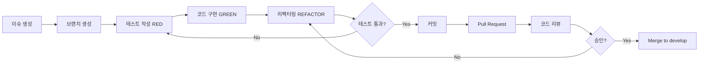

# 🔄 개발 워크플로우

이 문서는 StrideNote 프로젝트의 **개발 프로세스**와 **협업 방식**을 설명합니다.

---

## 📋 목차

- [Git 브랜치 전략](#-git-브랜치-전략)
- [커밋 컨벤션](#-커밋-컨벤션)
- [개발 프로세스](#-개발-프로세스)
- [코드 리뷰 가이드](#-코드-리뷰-가이드)
- [CI/CD 파이프라인](#-cicd-파이프라인)

---

## 🌿 Git 브랜치 전략

### Git Flow 전략 사용

```
main (프로덕션)
  └─ develop (개발)
       ├─ feature/* (기능 개발)
       ├─ bugfix/* (버그 수정)
       ├─ hotfix/* (긴급 수정)
       └─ release/* (릴리즈 준비)
```

### 브랜치 네이밍 규칙

| 브랜치 타입 | 패턴 | 예시 |
|:---:|:---:|:---|
| **기능 개발** | `feature/<기능명>` | `feature/google-login` |
| **버그 수정** | `bugfix/<버그명>` | `bugfix/gps-accuracy` |
| **긴급 수정** | `hotfix/<이슈명>` | `hotfix/login-crash` |
| **릴리즈** | `release/v<버전>` | `release/v1.0.0` |

---

## 📝 커밋 컨벤션

### Conventional Commits 사용

```
<type>(<scope>): <subject>

<body>

<footer>
```

### 타입 (Type)

| 타입 | 설명 | 예시 |
|:---:|:---|:---|
| `feat` | 새로운 기능 추가 | `feat: Add Google login` |
| `fix` | 버그 수정 | `fix: Fix GPS accuracy issue` |
| `docs` | 문서 변경 | `docs: Update README` |
| `style` | 코드 포맷팅 | `style: Format code with dartfmt` |
| `refactor` | 코드 리팩터링 | `refactor: Extract LocationService` |
| `test` | 테스트 추가/수정 | `test: Add AuthService tests` |
| `chore` | 빌드/설정 변경 | `chore: Update pubspec.yaml` |
| `perf` | 성능 개선 | `perf: Optimize GPS data processing` |

### 커밋 예시

```bash
# 좋은 커밋 메시지
feat(auth): Add Google native login for mobile

- Implement platform-specific Google Sign-In
- Use native SDK for iOS and Android
- Improve login success rate to 100%

Closes #123

# 나쁜 커밋 메시지
update code
fix bug
add feature
```

---

## 🔄 개발 프로세스

### TDD (Test-Driven Development) 사이클

```
┌─────────────────────────────────────┐
│        1. RED (실패하는 테스트)        │
│        테스트 작성 후 실행            │
│        ❌ 예상대로 실패 확인           │
└───────────────┬─────────────────────┘
                ↓
┌─────────────────────────────────────┐
│        2. GREEN (테스트 통과)         │
│        최소한의 코드 작성             │
│        ✅ 테스트 통과 확인             │
└───────────────┬─────────────────────┘
                ↓
┌─────────────────────────────────────┐
│        3. REFACTOR (리팩터링)         │
│        코드 개선 및 최적화            │
│        ✅ 테스트는 여전히 통과         │
└───────────────┬─────────────────────┘
                ↓
         (반복)
```

### 기능 개발 플로우



---

## 👀 코드 리뷰 가이드

### 리뷰 체크리스트

#### 기능적 측면
- [ ] 요구사항을 정확히 구현했는가?
- [ ] 예외 상황을 적절히 처리했는가?
- [ ] 성능상 문제가 없는가?

#### 구조적 측면
- [ ] 단일 책임 원칙을 지켰는가?
- [ ] 중복 코드가 없는가?
- [ ] 네이밍이 명확한가?
- [ ] 레이어 분리가 적절한가?

#### 테스트 측면
- [ ] 테스트가 충분한가?
- [ ] 테스트가 실패 가능한가?
- [ ] 경계값 테스트가 있는가?
- [ ] 커버리지가 적절한가? (목표: 85% 이상)

#### 보안 측면
- [ ] 민감한 정보가 하드코딩되지 않았는가?
- [ ] 입력값 검증이 적절한가?
- [ ] 권한 체크가 있는가?

### 리뷰 코멘트 예시

```dart
// ✅ 좋은 코멘트
// 👍 GPS 필터링 로직이 잘 구현되었습니다!
// 💡 제안: 버퍼 크기를 상수로 추출하면 어떨까요?
// ❓ 질문: timeout이 발생하면 어떻게 처리되나요?
// ⚠️ 주의: 여기서 null 체크가 필요할 것 같습니다.

// ❌ 나쁜 코멘트
// "이 코드는 별로네요"
// "다시 짜세요"
// "이해가 안 되네요"
```

---

## 🚀 CI/CD 파이프라인

### GitHub Actions 워크플로우

```yaml
name: CI/CD Pipeline

on:
  pull_request:
    branches: [ develop, main ]
  push:
    branches: [ develop, main ]

jobs:
  test:
    runs-on: ubuntu-latest
    steps:
      - uses: actions/checkout@v3
      - uses: subosito/flutter-action@v2
      - run: flutter pub get
      - run: flutter test --coverage
      - run: flutter analyze
      
  build:
    needs: test
    runs-on: ubuntu-latest
    steps:
      - uses: actions/checkout@v3
      - uses: subosito/flutter-action@v2
      - run: flutter build apk --release
      
  deploy:
    needs: build
    if: github.ref == 'refs/heads/main'
    runs-on: ubuntu-latest
    steps:
      - name: Deploy to Production
        run: echo "Deploy to App Store / Play Store"
```

### 파이프라인 단계

```
1. 테스트 (Test)
   ├─ Unit Tests
   ├─ Widget Tests
   ├─ Integration Tests
   └─ Coverage Report

2. 린트 (Lint)
   ├─ flutter analyze
   ├─ dartfmt check
   └─ Custom lint rules

3. 빌드 (Build)
   ├─ Android APK
   ├─ iOS IPA
   └─ Web

4. 배포 (Deploy)
   ├─ TestFlight (iOS Beta)
   ├─ Google Play Internal Testing
   └─ Firebase App Distribution
```

---

## 📦 릴리즈 프로세스

### 버전 관리 (Semantic Versioning)

```
v<major>.<minor>.<patch>

예시:
- v1.0.0: 첫 번째 프로덕션 릴리즈
- v1.1.0: 새로운 기능 추가
- v1.1.1: 버그 수정
```

### 릴리즈 체크리스트

- [ ] `develop` 브랜치 최신 상태 확인
- [ ] 모든 테스트 통과 확인
- [ ] `release/v<버전>` 브랜치 생성
- [ ] `CHANGELOG.md` 업데이트
- [ ] 버전 번호 업데이트 (`pubspec.yaml`)
- [ ] 릴리즈 노트 작성
- [ ] `main` 브랜치로 병합
- [ ] Git 태그 생성 (`git tag v1.0.0`)
- [ ] 앱 스토어/플레이 스토어 배포

---

## 🐛 버그 리포트 템플릿

```markdown
## 🐛 버그 설명
간단하고 명확한 버그 설명

## 📋 재현 단계
1. '...'로 이동
2. '...'를 클릭
3. '...'까지 스크롤
4. 에러 발생

## 🤔 예상 동작
어떤 동작이 일어나야 하는지

## 😱 실제 동작
실제로 어떤 동작이 일어났는지

## 📱 환경
- OS: [iOS 17.0 / Android 14]
- 디바이스: [iPhone 15 Pro / Pixel 7]
- 앱 버전: [v1.0.0]

## 📸 스크린샷
가능하다면 스크린샷 첨부

## 💡 추가 컨텍스트
기타 추가 정보
```

---

## 📚 참고 자료

- [Git Flow](https://nvie.com/posts/a-successful-git-branching-model/)
- [Conventional Commits](https://www.conventionalcommits.org/)
- [Flutter 테스트 가이드](https://flutter.dev/docs/testing)
- [Clean Code](https://www.amazon.com/Clean-Code-Handbook-Software-Craftsmanship/dp/0132350882)

---

**마지막 업데이트**: 2025년 10월

